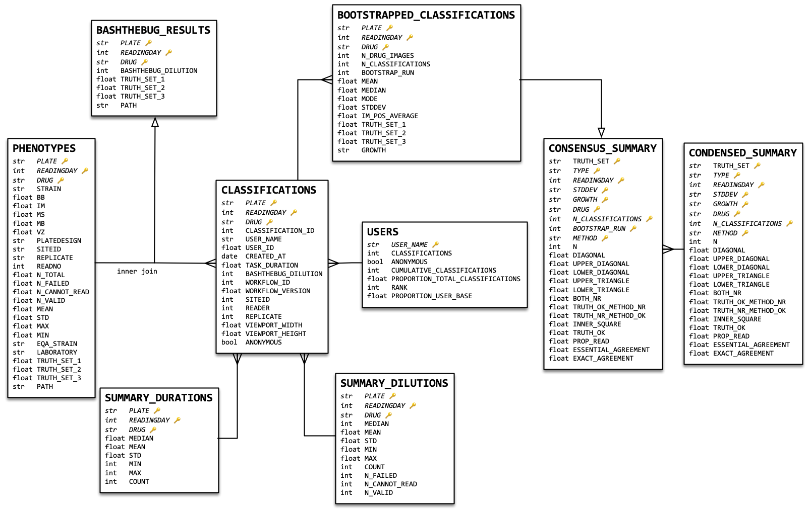

[](https://mybinder.org/v2/gh/fowler-lab/bashthebug-consensus-dataset/HEAD)

# BashTheBug dataset for finding the optimal consensus method

## Purpose

This repository contains the raw data tables used in the below scientific preprint that is currently under review at a journal. Its aim is to ensure that the results can be reproduced by other people and therefore a Jupyter notebook is included that allows one to recreate nearly all the figures and tables in the manuscript from the raw data tables.

> *BashTheBug: a crowd of volunteers reproducibly and accurately measure the minimum inhibitory concentrations of 13 antitubercular drugs from photographs of 96-well broth microdilution plates*
> 
> Fowler PW, Wright C, Spiers H, Zhu T, Baeten EML, Hoosdally SW, Gibertoni Cruz AL, Roohi A, Kouchaki S, Walker TM, Peto TEA, Miller G, Lintott C, Clifton D, Crook DW, Walker AS, The CRyPTIC Consortium
> 
> bioRxiv preprint [doi:10.1101/2021.07.20.453060](https://doi.org/10.1101/2021.07.20.453060)

This README will be updated when the manuscript is published in a scientific journal.

Philip W Fowler, 10 Nov 2021

## Installation

This isn't a software module, but is instead a collection of data tables and a jupyter notebook that reads and analyses the data, creating the figures and tables in the manuscript.

That said, the notebook does have a number of prerequisites which are specified in `requirements.txt` and `setup.py`. These are `numpy`, `pandas`, `scipy` and `matplotlib` and the versions used in development are specified in `setup.py`, should you wish to fix them to solve any future reproducibility problems.

### Running locally 

Simply install as you would a regular Python module -- this will install or update the prerequisites

```
$ python3 setup.py install --user
```

### Running in browser using MyBinder

Click the `launch binder` button at the top of this `README`; this will use the MyBinder service to create a Docker container and install the pre-requisites listed in `requirements.txt`. Due to the limited memory available to the container, there is a flag `running_in_binder` that you will need to set to `True` to stop the code trying to load the large `BOOTSTRAPPED_CLASSIFICATIONS` table since that will fail.

## Data tables

These are described in the schema below and are found, as gzipped `csv` files in `tables/`



There are two main raw data tables:

`CLASSIFICATIONS` is derived from the CSV exported by the Zooniverse by a Python package [bashthebug](https://github.com/fowler-lab/bashthebug) which is built off a generic Zooniverse class provided by another Python package [pyniverse](https://github.com/fowler-lab/pyniverse).

`PHENOTYPES` contains the measurements (stated here as dilutions) made by laboratory scientists as part of the study published below:

> *Validating a 14-Drug Microtiter Plate Containing Bedaquiline and Delamanid for Large-Scale Research Susceptibility Testing of Mycobacterium tuberculosis*
> 
> Rancoita PMV, Cugnata F, Gibertoni-Cruz AL, Borroni E, Hoosdally SJ, Walker TM, Grazian C,  Davies TJ, Peto TEA, Crook DW, Fowler PW, Cirillo DM and the CRyPTIC consortium
>
> Antimicrob Agent Chemo 2018;62:e00344 [doi:10.1128/AAC.00344-18](https://doi.org/10.1128/AAC.00344-18)

As described in the paper, during that study the laboratory scientists made measurements using a Thermo Fisher Vizion (`VZ`), a mirrored box (`MB`) and a microscope (`MS`). Since the Vizion also took a photograph, a measurement taken by some software, AMyGDA (`IM`).

AMyGDA is described in this paper and the software is available from [here](https://github.com/fowler-lab/amygda).

> *Automated detection of bacterial growth on 96-well plates for high-throughput drug susceptibility testing of Mycobacterium tuberculosis.*
>
> Fowler PW, Gibertoni Cruz AL, Hoosdally SJ, Jarrett L, Borroni E, et al.  
> 
> Microbiology 2018;164:1522–1530. [doi:10.1099/mic.0.000733](https://doi.org/10.1099/mic.0.000733)

## Recreating the figures and tables

Open the jupyter-notebook `recreate-figures-and-tables.ipynb` and run the cells, either one at a time, or all in one go. There are some comments describing which table or figure is created by a particular cell and all figures are written out to a `pdf/` folder that will be automatically created in this repository.
